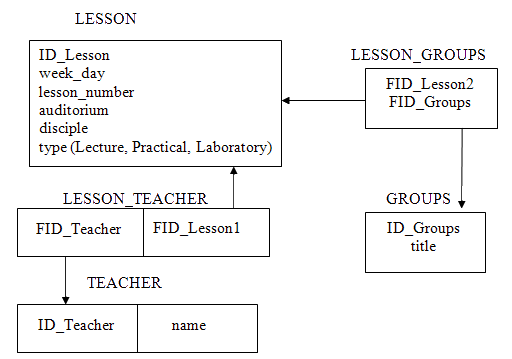
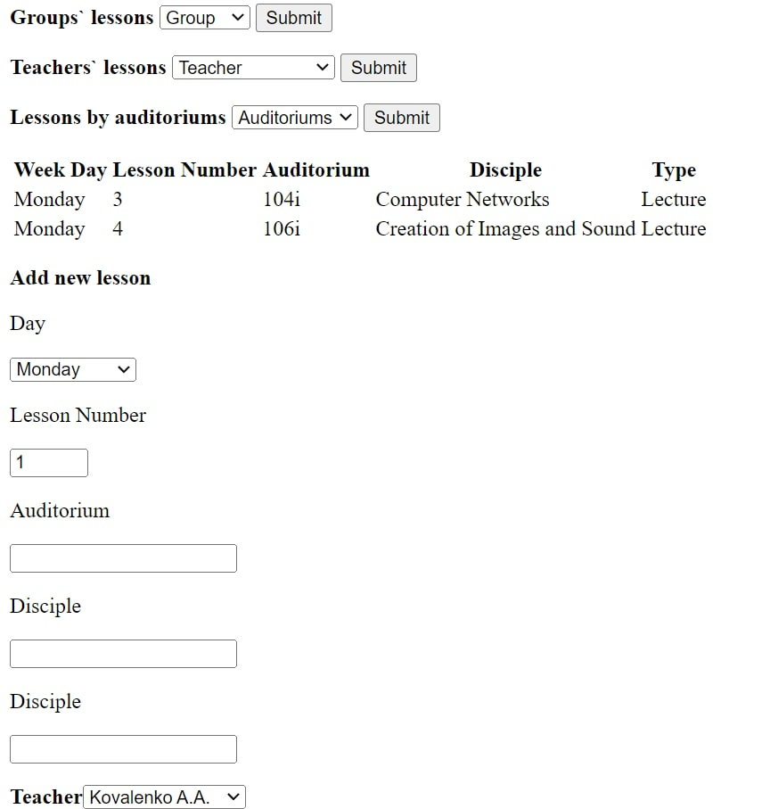
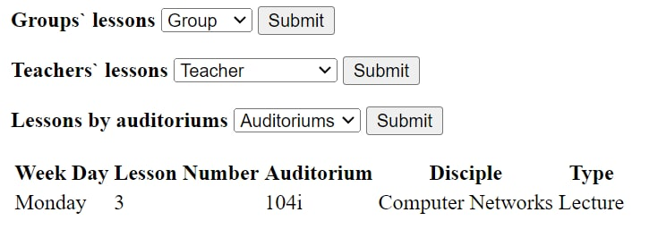
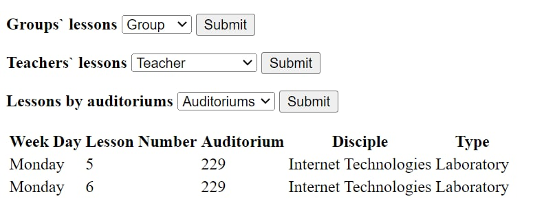

## Василенко Д.В. КІУКІу-20-2 Вариант 1.
___
Вариант 1. Импортировать БД для хранения информации о расписании проведения занятий (Рисунок 5.1).

Рисунок 5.1 – Структура базы данных «Расписание занятий»

Для каждого занятия задается день недели, номер пары, аудитория, группа, название дисциплины, вид занятия.

Сформировать запросы и вывести расписание занятий для:

- произвольной группы из списка;
- произвольного преподавателя из списка;
- аудитории из списка.

Обеспечить возможность добавления новых практических занятий (с указанием существующих группы и преподавателя) в БД средствами веб-приложения. Обратите внимание на работу с ключевыми полями.

Примеры скриншотов стартовой страницы и фрагмента страницы результата запроса для расписания группы КИ-12-1. В данном варианте на стартовой странице имеется четыре формы - по одной для каждого из запросов на выборку и отдельная большая форма для ввода параметров для запроса на добавление данных.

##Результаты

