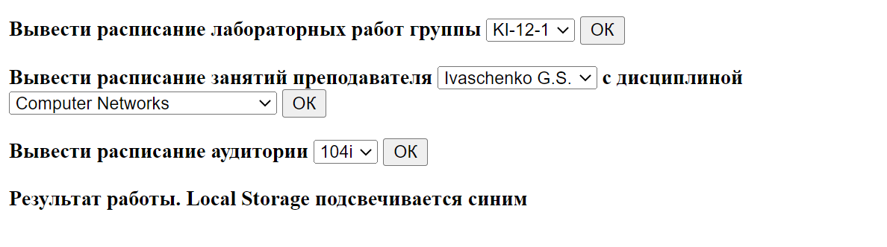
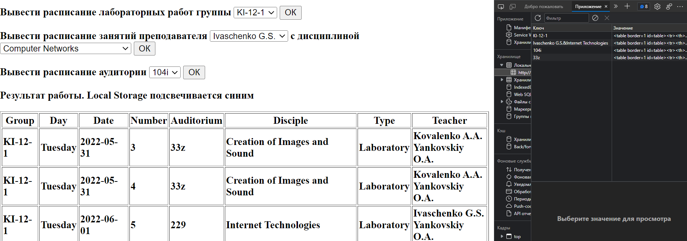
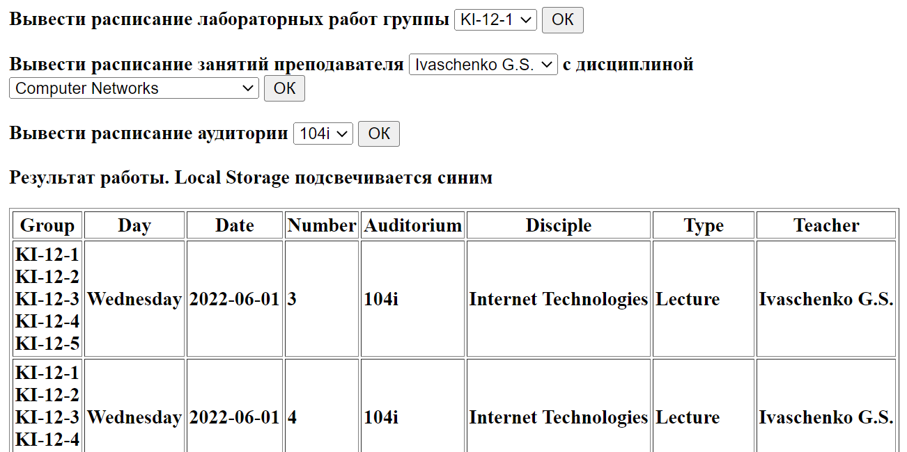
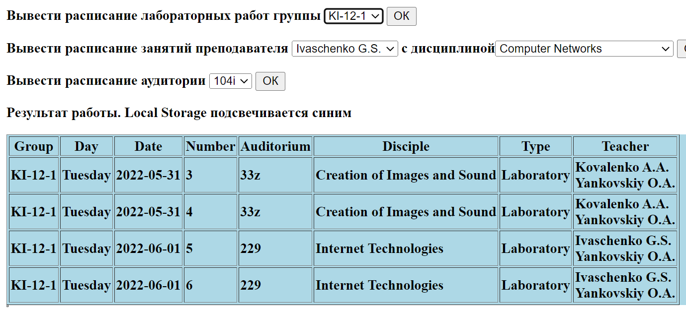

##Василенко Д.В. КІУКІу-20-2 Вариант 1.
___
Создать и заполнить БД для хранения информации о расписании занятий (достаточно одной коллекции).
Каждое занятие описывается датой проведения, временем (указывается номер пары), аудиторией, дисциплиной, типом (лекция, лабораторная, зачет и т.д.), группой (групп может быть больше одной - например, для лекций это нормальное явление), преподавателем (он также может быть указан не один).
Предоставить пользователю возможность получения информации о расписании занятий для:
лабораторных работ выбранной из списка группы;
лекций указанного преподавателя по указанной дисциплине;
аудитории.
___
##Результат

___

___

___

___